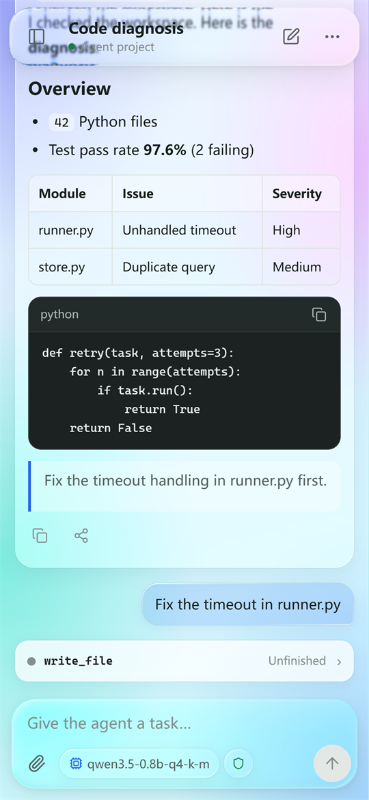
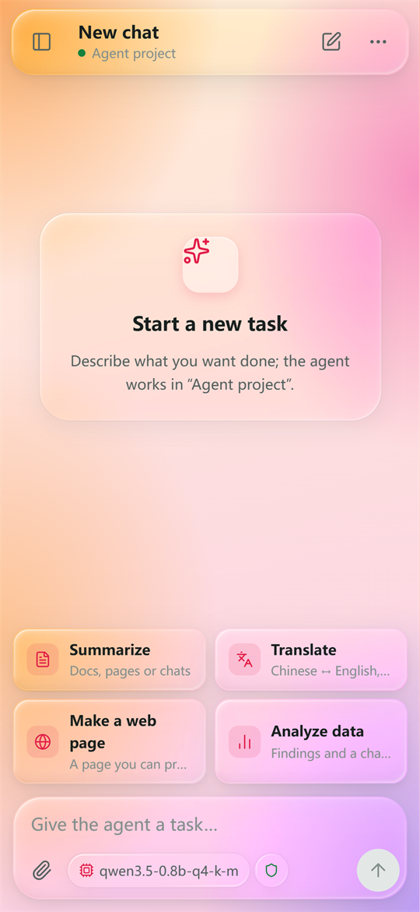
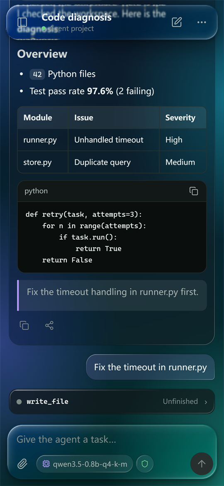
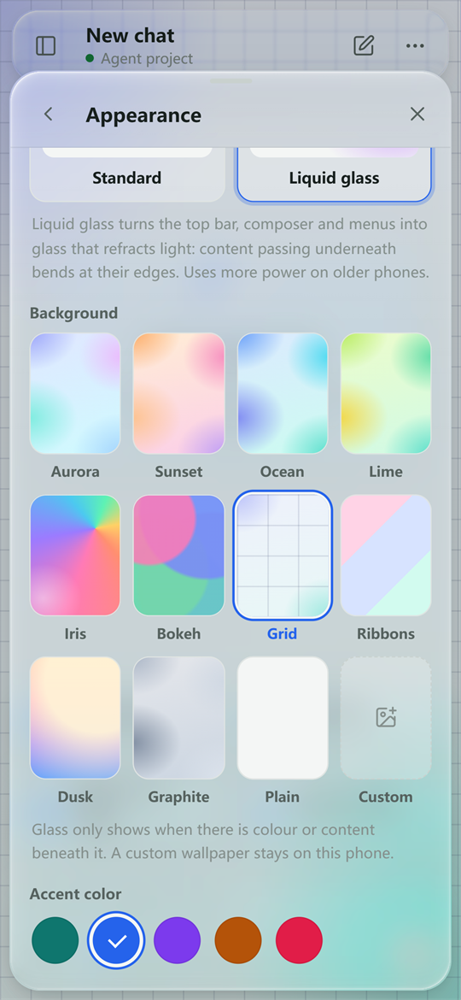

[English](README.md) | [简体中文](README.zh-CN.md)

# Agent Workspace for Android

An AI agent that runs on your Android phone. It plans and carries out multi-step tasks with real tools — files, PDFs, web search, an optional Linux toolchain and Android automation — using a cloud model you choose or a model that runs entirely on the phone. Everything is packaged in one APK; no Termux or root is needed.

<p align="center">
  
  
  
</p>

## Download

Get `AgentWorkspace_1.3.0_android.apk` from [Releases](https://github.com/WhitePepperLambSoup/agent-workspace-android/releases) and install it. The release notes list its SHA-256. Later versions can be installed from inside the app (Menu → About and updates, or "Updates" on the loading screen).

- Android 8.0 (API 26) or newer, 64-bit ARM (`arm64-v8a`) or `x86_64`; phones running a 32-bit-only system cannot install it.
- The interface is shown by the system's Android System WebView, which must be Chromium 80 or newer. If WebView is disabled, missing or too old, the app explains why and links to the app store to update it.
- Works on Android 15+ devices with 16 KB memory pages, foldables, split screen and external keyboards, and keeps its own colours under system or vendor "force dark" modes.
- About 75 MB to install. Local models are optional downloads inside the app.

## Highlights

1. **Real multi-step tasks.** The agent plans, calls tools and shows every step live: the streamed reply, its reasoning, and each tool call as running, finished, failed or cancelled.
2. **Add to a running task.** Type while a task runs and your message joins it; the agent takes it into account at its next step instead of starting over.
3. **Approvals you control.** Three execution modes — workspace only, YOLO, full access — and an approval prompt before sensitive actions; a long task can be approved as a whole, while deleting files, changing long-term memory and operating other apps still ask every time.
4. **Cloud or on-device models.** OpenAI-compatible APIs (OpenAI, DeepSeek, Qwen, Kimi, GLM, xAI …), Anthropic, Gemini and Ollama; or download a Qwen3 / Qwen3.5 GGUF model and run it offline on the phone's CPU through llama.cpp, including image input with Qwen3.5. On-device models reuse the system prompt and conversation they already evaluated, so a new conversation starts answering in about 1–2 seconds; chips with dot-product instructions get an accelerated build, and inference slows down on its own when the phone runs hot. Models download from ModelScope (a mainland China CDN) or Hugging Face, and a paused download can continue from the other source; a grammar keeps small models' tool calls well-formed.
5. **Workspaces and files.** Each workspace is a folder. Generated files can be opened, previewed (Markdown, images, sandboxed HTML), shared or saved; text files can be edited in the app, and workspaces appear in Android's file picker.
6. **Share anything in.** Share files from WeChat, QQ or any app into a conversation; PDFs are read page by page with OCR for scanned pages.
7. **Memory.** The AI remembers your preferences and recurring details within limits (at most 30 notes, no near-duplicates); the Memory page shows, edits and deletes them.
8. **Knowledge base.** Add manuals, contracts, notes and e-books (PDF, Word, Excel, EPUB, web pages, Markdown, text) and the AI answers from the relevant passages, citing the document and page. Documents stay on the phone and are searched by keyword with built-in and custom synonyms: no model download, no API usage.
9. **Alarms, timers and calendar.** Say "wake me at 7 tomorrow" or "remind me in 20 minutes" and the AI sets it in the system Clock app; with calendar access it can also list and add events.
10. **Built-in browser.** The AI uses the phone's WebView to open pages, read sites that need JavaScript, click, fill in forms and take screenshots, asking your approval before opening pages and clicking.
11. **Background services and long commands.** Web servers, bots and other programs the AI starts keep running, with output and controls on the Background services page; installs and builds can run for up to 30 minutes with live output.
12. **Ask from anywhere.** An "Ask Agent" quick settings tile, a floating bubble that can ask about the current screen or a part of it you circle, home screen widgets (quick ask, task status, quick tasks), app icon shortcuts, and asking about a photo.
13. **Notification rules.** When a notification from an app you chose arrives, the AI handles it the way you describe, such as noting a parcel pickup code; by default it asks you first.
14. **Math and diagrams.** LaTeX formulas and Mermaid diagrams in replies are rendered.
15. **Model profiles.** Switch between your usual providers and models in one tap, without restarting the engine between cloud models; edit and resend messages, or regenerate a reply.
16. **Backup and restore.** Conversations, memory, automation, workspace files and settings go into one zip for a new phone or a reinstall.
17. **Liquid-glass interface.** An Apple-style glass look with real edge refraction and light-catching rims, twelve backgrounds or your own wallpaper, five accent colours, light/dark themes and adjustable motion — or a plain standard style. The quick tasks above the input are yours to edit, and the menu has a search box for features and settings.
18. **Chinese and English.** The interface follows the system language or can be switched at any time.
19. **Automation.** Scheduled tasks, reusable workflows with step replay, task evaluations and hand-off between devices.
20. **Optional developer toolchain.** A pinned Alpine toolchain (Git, Python, Node, Pyright) installs on demand and runs in an isolated PRoot process.
21. **Phone control (opt-in).** With the accessibility service enabled, the agent can tap, type and navigate apps under your approval; password fields and the lock screen are off limits.
22. **Recovers on its own.** If Android stops the engine, the app restarts it and reconnects; logs can be exported with secrets removed — shared, saved, or sent as a GitHub issue — even from the loading screen when the app cannot start.
23. **Offline speech recognition.** With the SenseVoice Small speech model (about 239 MB) downloaded, the microphone recognises Chinese, English, Japanese, Korean and Cantonese on the phone without uploading audio, and the AI can transcribe recordings and videos in the workspace into timestamped text.

<p align="center">
  
</p>

## Quick Start

1. Install the APK and open it. The first launch prepares the built-in Python runtime.
2. Open the menu (⋯) → **Provider & API settings** to enter a cloud provider and API key, or **Local models** to download a model that runs on the phone.
3. Type a task, or tap one of the shortcuts. The chips under the input switch the model and thinking effort; the shield sets the execution mode (green: workspace, yellow: YOLO, red: full access).
4. While the task runs, type to add instructions, or tap stop. Generated files appear under the reply.

## Tech Stack

| Layer | Technology |
|---|---|
| App shell | Kotlin, Android WebView, foreground service, WorkManager |
| Interface | HTML / CSS / JavaScript (no framework), SVG-filter refraction for the glass style |
| Agent engine | Python 3.12 embedded with Chaquopy, running the shared `agent_workspace` core in its own process |
| Local inference | llama.cpp (pinned revision) through JNI, CPU only; an ARMv8.2 dot-product build is chosen per chip |
| Storage | SQLite event store in app-private storage; credentials encrypted with Android Keystore |
| Optional tools | PRoot launcher with a pinned Alpine 3.22 toolchain |

## Build from Source

Prerequisites: JDK 17, Python 3.12, [uv](https://docs.astral.sh/uv/), Android SDK 35 with NDK 27.3.13750724 and CMake 3.22.1.

```bash
git clone https://github.com/WhitePepperLambSoup/agent-workspace-android.git
cd agent-workspace-android
uv sync --frozen --python 3.12.10

# Download and verify pinned inputs (llama.cpp source, launchers, licences) and package app assets
uv run python "for Android/build_release.py" --prepare-only

# Debug APK (point the build at the Python 3.12 interpreter)
export AGENT_WORKSPACE_BUILD_PYTHON="$(uv run python -c 'import sys; print(sys.executable)')"
cd "for Android/kotlin_app" && ./gradlew assembleDebug
```

The bundled Markdown renderer and icons (`web_companion/static/mobile-vendor.js`) are committed; to regenerate them, install Node.js 22 and run `npm ci --prefix "for Android" --ignore-scripts` then `npm --prefix "for Android" run build:vendor`.

A signed release needs your own keystore in four environment variables — `AGENT_ANDROID_KEYSTORE`, `AGENT_ANDROID_KEY_ALIAS`, `AGENT_ANDROID_STORE_PASSWORD`, `AGENT_ANDROID_KEY_PASSWORD` — and then `uv run python "for Android/build_release.py" --signed`. See [the build and release guide](for%20Android/10_APK_BUILD_AND_RELEASE_GUIDE.md).

## Directory Layout

```
agent-workspace-android/
├── for Android/
│   ├── kotlin_app/          Android project: WebView host, native bridges, accessibility, JNI llama.cpp
│   ├── web_companion/       App interface (HTML/CSS/JS), copied into the APK at build time
│   ├── mobile_*.py          Mobile gateway, task controller, workspaces, model manager
│   ├── training/            Fine-tuning source and frozen synthetic datasets (no weights)
│   └── docs/                Design notes, plans and reviews
├── src/agent_workspace/     Shared agent engine (runner, tools, providers, storage)
└── docs/screenshots/        Images used in this README
```

## Privacy and Security

- Conversations, files and settings stay in the app's private storage on your phone. Model requests go to the provider you configure, or stay on the phone with a local model.
- API keys are stored encrypted with Android Keystore and are never shown back in the interface.
- The engine listens only on `127.0.0.1`, requires a per-launch token, and proves its identity to the app before the token is handed over.
- Diagnostic logs are only created and shared when you tap the button; the engine token and API keys are masked.
- Memory stays on the phone and never holds passwords, keys, verification codes or ID numbers; you can review, delete or turn it off at any time.
- Knowledge base documents stay on the phone. With a cloud model, the passages found for a question are sent to your provider along with it; to avoid that, turn off "Attach relevant passages to each question" or use an on-device model. Passages are marked as reference material for the model, not as instructions.
- The built-in browser exposes no app interface to web pages, opens only http/https pages and keeps its sign-ins apart from the app's interface; its data can be cleared in one tap.
- The system permissions behind notification rules and the floating bubble are requested only when you turn those features on; notification rules read only the apps you chose and pass a notification's content only to the task it triggers.
- Backups never contain API keys.
- Offline speech recognition processes audio on the phone only; recordings are neither uploaded nor kept. Circle to ask sends only the screenshot you circled to the model, and takes no screenshot while a password field is on screen.

## Known Limitations

- Android and phone makers may still freeze or stop background work; the app recovers when reopened, but a task interrupted at that moment needs to be resumed. Background services stop when the engine restarts; those marked "Start with the engine" run again.
- The built-in browser is a WebView that is not on screen, so the few pages that draw only on animation frames may render incompletely, and some phones cannot capture it as an image; the AI then reads the page text instead.
- On-device models run on the CPU, so speed depends heavily on the phone. For reference, Qwen3.5 2B on a Snapdragon 888 processes about 28 prompt tokens and generates about 10 tokens per second; after switching to an on-device model the first conversation takes about a minute to start answering, later ones about 1–2 seconds; long tasks such as rewriting a whole web page or analysing a file of tens of KB take from ten to several tens of minutes, and slow down when the phone gets hot. 2B needs about 1.8 GB of available memory; phones with less should use 0.8B.
- Small models handle questions, reading and writing files and simple pages; for complex edits their code is often incomplete, so check it or use a cloud model.
- The knowledge base searches by keyword and does not understand meaning: a question worded completely differently, outside the synonym list, may miss the relevant passage; add your own synonyms on the Knowledge base page. Scanned PDFs have no text layer and are not supported yet.
- While the app is in the background, Android does not let it open the system Clock app, so alarms and timers arrive as a notification that you tap to finish.
- Offline speech recognition runs on 64-bit ARM phones only; x86_64 devices use the system recogniser.
- Launchers do not let a widget blur the wallpaper behind it, so the glass-style widgets approximate the look with translucency and highlights.
- Web search uses the free DuckDuckGo and Bing pages, so results and availability depend on your network; some phrasings return nothing, and the AI then rephrases.
- The English interface text was written by the developer; corrections are welcome.

## License

Apache License 2.0 — see [LICENSE](LICENSE). Third-party components and their licences are listed in [THIRD_PARTY_NOTICES.md](for%20Android/THIRD_PARTY_NOTICES.md).
