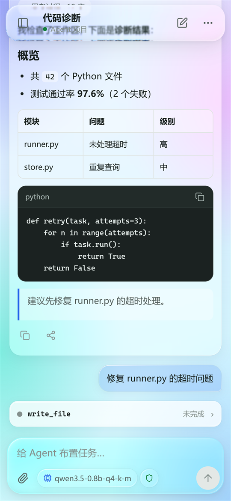
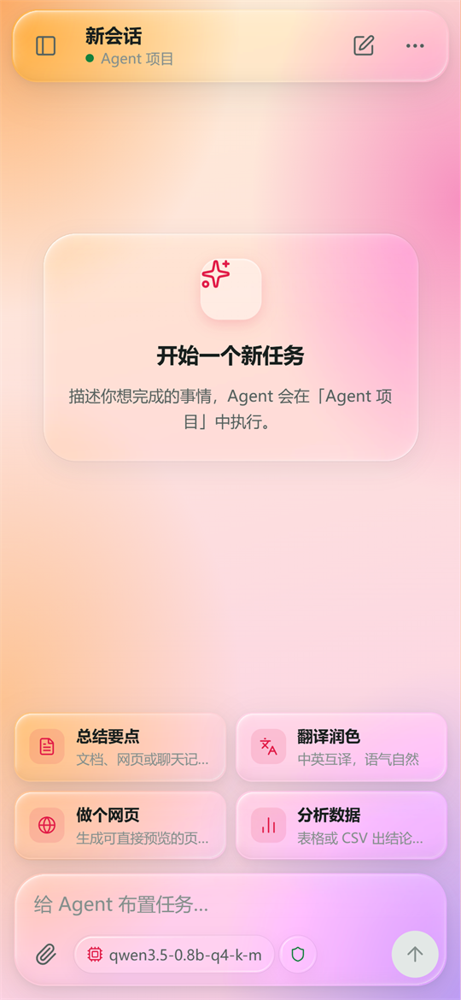
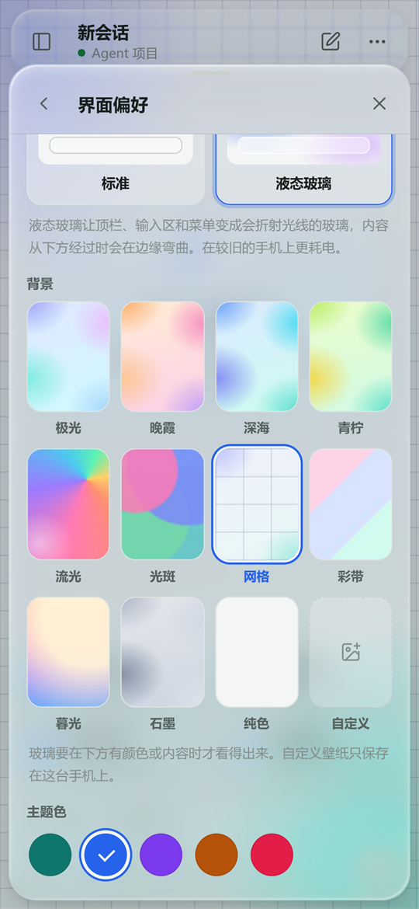

[English](README.md) | [简体中文](README.zh-CN.md)

# Agent Workspace 安卓版

在安卓手机上运行的 AI Agent。它能规划并执行多步骤任务，调用真实的工具——文件、PDF、网页搜索、可选的 Linux 工具链和安卓系统操作——使用你选择的云端模型，或完全在手机上运行的本地模型。全部打包在一个 APK 里，不需要 Termux，也不需要 root。

<p align="center">
  
  
  
</p>

## 下载

在 [Releases](https://github.com/WhitePepperLambSoup/agent-workspace-android/releases) 下载 `AgentWorkspace_1.1.0_android.apk` 安装即可，SHA-256 写在发布说明里。之后的版本可在应用内更新（「设备与工具 → 版本与更新」，或加载页的「检查更新」）。

- 需要 Android 8.0（API 26）及以上，64 位 ARM（`arm64-v8a`）或 `x86_64`；纯 32 位系统的手机无法安装。
- 界面由系统的 Android System WebView 显示，需要 Chrome 80 及以上的内核。WebView 被停用、缺失或过旧时，应用会说明原因并引导到应用商店更新。
- 支持 Android 15+ 的 16 KB 内存页机型、折叠屏、分屏和外接键盘；在系统或厂商的「强制深色」下也保持应用自己的配色。
- 安装包约 57 MB；本地模型是应用内的可选下载。

## 亮点

1. **真正的多步骤任务**：Agent 自己规划、调用工具，每一步实时可见——流式回复、思考过程，以及每个工具调用的「执行中 / 已完成 / 失败 / 已取消」。
2. **任务中途插话**：任务执行时直接输入，消息会加入当前任务，Agent 在下一步采纳，不用从头再来。
3. **权限由你掌控**：三种执行模式（仅工作区 / YOLO / 完全访问），敏感操作前弹出审批。
4. **云端或本机模型**：支持 OpenAI 兼容接口（OpenAI、DeepSeek、通义千问、Kimi、智谱 GLM、xAI 等）、Anthropic、Gemini 和 Ollama；也可以下载 Qwen3 / Qwen3.5 GGUF 模型，通过 llama.cpp 在手机 CPU 上离线运行，Qwen3.5 还支持图片输入。
5. **工作区与文件**：每个工作区对应一个文件夹。生成的文件可直接打开、预览（Markdown、图片、隔离沙箱中的 HTML）、分享或另存；文本文件可在应用内编辑；工作区也会出现在系统文件选择器里。
6. **随手分享进来**：从微信、QQ 或任意应用分享文件到对话；PDF 按页读取，扫描页自动 OCR。
7. **记忆**：AI 会有节制地记住你的偏好和常用信息（最多 30 条，相似内容不重复记），在「记忆」页可查看、修改和删除。
8. **内置浏览器**：AI 用手机自带的 WebView 打开网页、读取需要脚本渲染的页面、点击、填表和截图，打开网页和点击前需要你批准。
9. **后台服务与长时间命令**：AI 启动的网页服务、机器人等可以一直运行，在「后台服务」页查看和停止；安装、编译最长可运行 30 分钟并实时显示输出。
10. **随处提问**：通知栏的「问 Agent」开关、悬浮球（可截屏提问）、长按桌面图标的快捷方式，以及拍照提问。
11. **通知触发**：选定应用的通知到达时，按你写的要求自动处理，例如记下快递取件码；默认每次先问你。
12. **公式与流程图**：回复中的 LaTeX 公式和 Mermaid 流程图直接渲染。
13. **多套模型配置**：常用的服务商与模型一键切换，云端模型之间切换不重启引擎；可以编辑消息重发、重新生成回复。
14. **备份与恢复**：会话、记忆、自动化、工作区文件和设置导出为一个 zip，换手机或重装后恢复。
15. **液态玻璃界面**：仿苹果液态玻璃，边缘有真实的折射和高光；十二种背景或自定义壁纸、五种主题色、浅色 / 深色、可调动画；也可以选简洁的标准风格。可自定义输入框上方的快捷任务。
16. **中英文界面**：默认跟随系统语言，随时可切换。
17. **自动化**：定时任务、可回放步骤的工作流、任务评测、跨设备接力。
18. **可选开发工具链**：按需安装固定版本的 Alpine 工具链（Git、Python、Node、Pyright），在隔离的 PRoot 进程中运行。
19. **操作手机（需手动开启）**：开启无障碍服务后，Agent 可在你的审批下点击、输入、切换应用；密码框和锁屏一律不碰。
20. **自动恢复**：安卓停掉引擎后，应用会自动重启引擎并重新连接；日志可导出（分享、保存或提交为 GitHub Issue），密钥会被隐藏；进不去应用时也能在加载页导出。

<p align="center">
  
</p>

## 快速开始

1. 安装 APK 并打开，首次启动会初始化内置的 Python 运行环境。
2. 打开菜单（⋯）→「服务商与 API 设置」填写云端服务和 API 密钥，或进入「本地模型」下载一个在手机上运行的模型。
3. 输入任务，或点一个快捷任务。输入框下方的芯片可切换模型与思考强度；盾牌图标是执行模式（绿色：仅工作区，黄色：YOLO，红色：完全访问）。
4. 任务执行中可以继续输入补充要求，也可以点停止。生成的文件显示在回复下方。

## 技术栈

| 层 | 技术 |
|---|---|
| 应用外壳 | Kotlin、Android WebView、前台服务、WorkManager |
| 界面 | 原生 HTML / CSS / JavaScript（无框架），液态玻璃用 SVG 滤镜实现折射 |
| Agent 引擎 | 通过 Chaquopy 内嵌的 Python 3.12，在独立进程中运行共享的 `agent_workspace` 核心 |
| 本地推理 | 固定版本的 llama.cpp，经 JNI 调用，仅用 CPU |
| 存储 | 应用私有目录中的 SQLite 事件库；凭据由 Android Keystore 加密 |
| 可选工具 | PRoot 启动器 + 固定版本的 Alpine 3.22 工具链 |

## 从源码构建

需要：JDK 17、Python 3.12、[uv](https://docs.astral.sh/uv/)、Android SDK 35（含 NDK 27.3.13750724 与 CMake 3.22.1）。

```bash
git clone https://github.com/WhitePepperLambSoup/agent-workspace-android.git
cd agent-workspace-android
uv sync --frozen --python 3.12.10

# 下载并校验固定版本的构建输入（llama.cpp 源码、启动器、许可证），打包应用资源
uv run python "for Android/build_release.py" --prepare-only

# Debug APK（让构建使用 Python 3.12 解释器）
export AGENT_WORKSPACE_BUILD_PYTHON="$(uv run python -c 'import sys; print(sys.executable)')"
cd "for Android/kotlin_app" && ./gradlew assembleDebug
```

界面用到的 Markdown 渲染器和图标（``web_companion/static/mobile-vendor.js``）已随源码提交；如需重新生成，安装 Node.js 22 后运行 ``npm ci --prefix "for Android" --ignore-scripts`` 和 ``npm --prefix "for Android" run build:vendor``。

签名的正式版需要你自己的 keystore，通过四个环境变量提供——`AGENT_ANDROID_KEYSTORE`、`AGENT_ANDROID_KEY_ALIAS`、`AGENT_ANDROID_STORE_PASSWORD`、`AGENT_ANDROID_KEY_PASSWORD`——然后运行 `uv run python "for Android/build_release.py" --signed`。详见[构建与发布指南](for%20Android/10_APK_BUILD_AND_RELEASE_GUIDE.md)。

## 目录结构

```
agent-workspace-android/
├── for Android/
│   ├── kotlin_app/          安卓工程：WebView 宿主、原生桥、无障碍、JNI llama.cpp
│   ├── web_companion/       应用界面（HTML/CSS/JS），构建时复制进 APK
│   ├── mobile_*.py          移动网关、任务控制器、工作区、模型管理
│   ├── training/            本地模型微调源码与冻结的合成数据集（不含权重）
│   └── docs/                设计、计划与审查文档
├── src/agent_workspace/     共享的 Agent 引擎（执行器、工具、模型接入、存储）
└── docs/screenshots/        本说明使用的截图
```

## 隐私与安全

- 对话、文件和设置保存在手机上的应用私有目录。模型请求只发往你配置的服务商；使用本地模型时不出手机。
- API 密钥由 Android Keystore 加密保存，界面上不会再显示。
- 引擎只监听 `127.0.0.1`，每次启动使用新的访问令牌，并在交出令牌前向应用证明身份。
- 诊断日志只在你点按钮时生成和分享，引擎令牌和 API 密钥会被隐藏。
- 记忆只保存在手机上，不会记住密码、密钥、验证码或证件号；可以随时查看、删除或关闭。
- 内置浏览器不向网页暴露任何应用接口，只能打开 http / https 网页，登录状态与应用界面分开保存，可一键清除。
- 通知触发、悬浮球所需的系统权限只在你打开对应功能时才请求；通知触发只读取你选定应用的通知，通知内容只交给被触发的任务。
- 备份文件不含 API 密钥。

## 已知限制

- 安卓系统和手机厂商仍可能冻结或停止后台运行；重新打开应用会自动恢复，但当时被中断的任务需要手动恢复。后台服务在引擎重启时会停止，勾选「随引擎启动」的会自动重新运行。
- 内置浏览器是不显示在屏幕上的 WebView，依赖动画帧渲染内容的少数网页可能显示不全；个别机型不能给它截图，这时 AI 会改为读取页面文字。
- 本地模型只用 CPU 运行，速度很依赖手机性能，小模型适合短任务。
- 英文界面文案由开发者撰写，欢迎指正。

## 许可证

Apache License 2.0，见 [LICENSE](LICENSE)。第三方组件及其许可证见 [THIRD_PARTY_NOTICES.md](for%20Android/THIRD_PARTY_NOTICES.md)。
